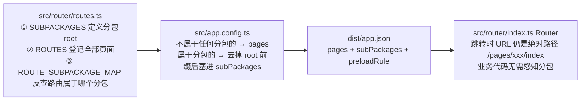

下面是整理好的完整笔记。我已经核对过仓库里的实际代码与 `dist` 产物，数字都是真实的。

---

# 微信小程序分包实现与排障笔记

> 记录时间：2026-09-01 　｜　适用仓库：`frontend`（Taro 跨端小程序）

## 0. 版本基线（很重要，排查前先对齐）

| 项 | 版本 / 值 | 来源 |
|---|---|---|
| Taro | **4.2.0**（`@tarojs/cli`、`@tarojs/webpack5-runner`、`@tarojs/plugin-platform-weapp`、`@tarojs/taro-loader` 全部锁 4.2.0） | `package.json` |
| 编译器 | **webpack5**（`compiler.type: 'webpack5'`），`compiler.prebundle.enable: false` | `config/index.ts` |
| 文件系统缓存 | **`cache.enable: false`** | `config/index.ts` |
| 框架 / UI | React 18.3.1，`@nutui/nutui-react-taro` 声明 `^2.6.14`、实际安装 **2.7.15** | `package.json` / `dist` 产物路径 |
| 设计稿 | `designWidth: 375`，`selectorBlackList: ['nut-']` | `config/index.ts` |
| 本次报错环境 | 微信开发者工具 **Windows 2.02.2608060**，基础库 **3.17.2** | 报错信息 |
| 输出目录 | `BUILD_ENV=dev` + `TARO_ENV=weapp` → `dist`；其它组合 → `dist_${BUILD_ENV}_${TARO_ENV}` | `config/index.ts` |

> ⚠️ **换 Taro 大版本后本笔记需重新核对**，尤其是 `optimizeMainPackage` 的默认值与产物结构（3.x 与 4.x 行为有差异）。

---

## 1. 分包是怎么实现的（本仓库架构）

### 1.1 三处代码，形成一个闭环



**① `src/router/routes.ts` — 唯一权威来源**

```ts
export const SUBPACKAGES = {
  face:         { root: 'pages/face-recognition' },
  guide:        { root: 'pages/guide' },
  relationship: { root: 'pages/relationship-decoder' },
  archive:      { root: 'pages/archive' },
  scenario:     { root: 'pages/scenario-sandbox' },
  training:     { root: 'pages/training' },
} as const;

export const ROUTES = { HOME: 'pages/home/index', /* ... */ } as const;
```

```ts
// 路由 → 分包 反查：value 以 `root + '/'` 开头即归属该分包
const root = SUBPACKAGES[key].root;               // e.g. 'pages/face-recognition'
if (full.startsWith(root + '/')) map[rk] = key;
```

**② `src/app.config.ts` — 自动生成，禁止手改 `pages`**

```ts
const mainPackagePages = (Object.keys(ROUTES) as RouteKeys[])
  .filter(rk => !ROUTE_SUBPACKAGE_MAP[rk])
  .map(rk => ROUTES[rk]);

const subPackages = (Object.keys(SUBPACKAGES) as (keyof typeof SUBPACKAGES)[]).map(key => {
  const root = SUBPACKAGES[key].root;
  const pages = (Object.keys(ROUTES) as RouteKeys[])
    .filter(rk => ROUTE_SUBPACKAGE_MAP[rk] === key)
    .map(rk => ROUTES[rk].slice(root.length + 1)); // 关键：去掉 'pages/xxx/' 前缀
  return { root, pages };
});

export default defineAppConfig({ pages: mainPackagePages, subPackages, preloadRule: {...} })
```

**③ 跳转层不需要任何分包逻辑**（`src/router/index.ts`）

```ts
buildUrl(page, params) { let url = `/${ROUTES[page]}`; /* ... */ }
```
跨分包跳转与同包跳转写法完全一致（都是绝对路径 `/pages/relationship-decoder/guide-chapter-3/index`），微信会在首次跳转时下载对应分包。`Router.to` 只在页面栈 ≥10 层时降级为 `redirectTo`，与分包无关。

### 1.2 当前分包全景（`dist/app.json` 实测，共 79 个页面）

| 包 | root | 页面数 | 备注 |
|---|---|---|---|
| **主包** | — | **9** | `home`、`me`、`me/edit`、`deep-review`、`power-test-history/revisit/done`、`demo`、`demo/ai-share` |
| face | `pages/face-recognition` | 7 | AI 看脸四步 + 预付/支付成功/结果 |
| guide | `pages/guide` | 9 | 专属指南 4 章 + 打卡系列 |
| relationship | `pages/relationship-decoder` | 16 | 关系解码（最大业务包） |
| archive | `pages/archive` | 14 | 关系档案馆 |
| scenario | `pages/scenario-sandbox` | 16 | 情景沙盘 |
| training | `pages/training` | 8 | 修炼场 |

```jsonc
// dist/app.json（节选）
"subPackages": [
  { "root": "pages/relationship-decoder",
    "pages": ["select-archive/index", "step1/index", ..., "guide-chapter-3/index", ...] }
],
"preloadRule": {
  "pages/home/index": { "network": "all", "packages": ["pages/face-recognition", "pages/relationship-decoder"] }
},
"lazyCodeLoading": "requiredComponents"
```

- `preloadRule` 的 `packages` 必须写**分包 root**，不是页面路径。
- `lazyCodeLoading: requiredComponents` = 按需注入，会让 WXSS 编译错误**延迟到进入该子页时才暴露**（本次报错就是点首页进子页才出现）。

---

## 2. 微信分包的硬性约束（改动前必看）

1. **主包 ≤ 2MB，单个分包 ≤ 2MB，整包 ≤ 30MB**。
2. **tabBar 页面必须在主包**（本仓库 tabBar 已注释，若将来启用，列表页必须留在主包）。
3. **分包 root 之间不能嵌套**：不能同时存在 `pages/archive` 和 `pages/archive/sub`。
4. **分包之间不能互相引用 JS / WXSS**，但**分包页面可以引用主包资源**（这就是下面 `sub-common` 要被复制到每个分包的根本原因）。
5. `src/pages/<root>/**` 下的**任何**页面，只要登记进 `ROUTES`，就自动属于该分包——不需要额外配置。
6. **只登记在 `ROUTES` 里的页面才会被打包**：`app.config.ts` 的 `pages` 由 `ROUTES` 生成，新页面不登记 = 不编译 = 运行时报 page not found。

---

## 3. Taro「智能提取分包依赖」（`optimizeMainPackage`）

### 3.1 默认就是开启的（Taro 4.2.0）

```js
// node_modules/@tarojs/webpack5-runner/dist/webpack/MiniCombination.js
this.optimizeMainPackage = { enable: true };
```

只要有 `subPackages`，`MiniSplitChunksPlugin` 就会生效，产出两类文件：

| 产物 | 触发条件 | 说明 |
|---|---|---|
| `<分包root>/sub-vendors.(js\|wxss)` | module 被**同一个分包内的多个页面**引用 | 抽到分包根目录 |
| `<分包root>/sub-common/<md5>.(js\|wxss)` | module 被**多个分包**引用、且**主包无引用** | 先抽成一个公共模块，再**复制一份到每个用到的分包**（小程序不能跨分包引用） |

文件名 = `md5(module.resource)`。插件会在页面 `index.wxss` 头部注入 `@import "../sub-common/xxx.wxss";`、在 `index.js` 头部注入 `require("../sub-common/xxx.js");`，然后**把根目录的 `sub-common/*` 从 assets 里删掉**。

```js
// MiniSplitChunksPlugin.js：注入 + 删除根 sub-common
if (ext === FileExtsMap.STYLE) source.add(`@import ${JSON.stringify(`${chunkRelativePath}`)};`);
if (ext === FileExtsMap.JS)    source.add(`require(${JSON.stringify(`${chunkRelativePath}`)});`);
// ...
for (const assetPath in assets) {
  if (new RegExp(`^${SUB_COMMON_DIR}\\/.*`).test(assetPath)) delete assets[assetPath];
}
```

### 3.2 本次实际被抽走的东西（`dist` 实测）

```
dist/pages/relationship-decoder/sub-common/480296dba7e6ae593ff9cf780e4c1ed7.wxss
   ← src/components/CustomBottomPopup/index.scss
dist/pages/relationship-decoder/sub-common/4c31b0475e297361c675320b2e799241.js
   ← @nutui/nutui-react-taro/dist/esm/radio.taro-M2in687s.js
dist/pages/relationship-decoder/sub-common/31fbc6772ddc78b65a953b8ed9d6c540.js
   ← @nutui/.../Radio/style/css.js
dist/pages/relationship-decoder/sub-common/deac76a34eb8366b5bc0f885976edeec.js
   ← @nutui/.../TextArea/style/style.css
```

规律：**跨分包复用的公共组件 / NutUI 组件**（`CustomBottomPopup`、NutUI Radio/TextArea 等）。`training` 分包没有 `sub-common`、`scenario-sandbox` 只有 2 个文件——说明它们与其它分包的共用模块少。

### 3.3 两个致命副作用（记住）

- **Taro 不会自动清空输出目录**。加分包前后、`sub-common` 的 md5 集合会变，`dist` 里新旧产物混在一起 → 页面 wxss 已重写、对应 `sub-common` 文件却没落盘。
- 官方已知问题：[#10334](https://github.com/NervJS/taro/issues/10334)（dev 下 `sub-common` 越堆越多）、[#14589](https://github.com/NervJS/taro/issues/14589)（**开启 webpack `cache` 后 `sub-common` 内容不更新**）。本仓库 `cache.enable: false`，若将来开启持久化缓存，这条风险会回来。

---

## 4. 本次报错：现象 / 根因 / 解法

### 4.1 现象

从首页点进子页时：

```
[ WXSS 文件编译错误]
path `../sub-common/480296dba7e6ae593ff9cf780e4c1ed7.wxss` not found
from `./pages/relationship-decoder/guide-chapter-3/index.wxss`
(env: Windows,mp,2.02.2608060; lib: 3.17.2)
```

### 4.2 根因（一句话）

**不是分包路径配置错误，而是产物状态不一致**：页面 `index.wxss` 里 `@import` 的 `sub-common` 文件，在当天打开的那份 `dist` 里不存在（旧产物残留 / watch 增量未同步 / 开发者工具缓存）。

自查证据：当前 `dist` 里 `dist/pages/relationship-decoder/sub-common/480296dba7e6ae593ff9cf780e4c1ed7.wxss` **确实存在**，说明路径算法本身正确（`guide-chapter-3/` 的 `../sub-common/` → `relationship-decoder/sub-common/`），只缺"重新全量构建"。

### 4.3 解法（按优先级，逐级加码）

**方案 1（首选，几乎必中）：清干净产物 + 清工具缓存**

```bash
# 1) 停掉 watch（Ctrl + C）
rm -rf dist
# 2) 微信开发者工具：清缓存 → 全部清除；重新编译（最好退出重开）
# 3) 全量重建
pnpm build:weapp      # 或 pnpm dev:weapp
```

构建后自检（判断到底是不是残留问题）：

```bash
# 页面引用的 sub-common 文件必须在「同一个分包」下存在
ls dist/pages/relationship-decoder/sub-common | grep 480296
# dist 根目录不应再有 sub-common（有 = 旧产物残留）
ls dist | grep sub-common
```

固化成脚本，防止复发（不引入新依赖）：

```json
{
  "scripts": {
    "clean:dist": "node -e \"require('fs').rmSync('dist',{recursive:true,force:true})\"",
    "dev:weapp": "npm run clean:dist && npm run build:weapp -- --watch"
  }
}
```

**方案 2（想根治这类问题）：关闭智能提取分包依赖**

```ts
// config/index.ts
mini: {
  optimizeMainPackage: { enable: false },   // ← 正确开关
}
```

- 效果：`sub-common` / `sub-vendors` 全部消失，页面 wxss 不再有 `../sub-common/*.wxss` 注入。
- 代价：跨分包复用的模块回到主包 `common.js` / `vendors.js` / `common.wxss`，**主包变大**。改完用「开发者工具 → 详情 → 代码依赖分析」确认主包没逼近 2MB。
- ⚠️ **注意**：`config/index.ts` 里被注释掉的 `mini.optimizer.subCommonChunksPlugin` **在 Taro 4.2 的 webpack5-runner 中不生效**，正确开关是 `mini.optimizeMainPackage`。

**方案 3（折中，推荐给主包敏感的项目）：只让「样式」退出分包抽取**

```ts
// config/index.ts
mini: {
  optimizeMainPackage: {
    enable: true,
    exclude: [
      // 样式不参与分包抽取 → 回到主包 common.wxss（子包页面可引用主包样式，微信允许）
      (module) => /\.(scss|sass|less|styl|css)$/.test(module.resource || ''),
    ],
  },
}
```

保留 JS 侧的分包优化，同时 wxss 侧永远不再出现 `sub-common` 引用。`exclude` 支持「绝对路径字符串」和「函数」两种写法（见 `MiniSplitChunksPlugin.isExcludeModule`）。

### 4.4 排查时的辅助手段

- 临时注释 `app.config.ts` 的 `lazyCodeLoading: "requiredComponents"` → 让所有 WXSS 在启动时一次性编译，能一次性看到全部错误（**不是修复手段，只是暴露问题**）。排完记得加回来。
- `dist/app.json` 是判断"分包划分是否符合预期"的第一现场：先看 `pages` / `subPackages` 对不对，再看 `dist` 里的文件。

---

## 5. 通用排障清单（以后遇到分包报错，按顺序走）

| # | 检查项 | 怎么做 |
|---|---|---|
| 1 | 是否旧产物残留 | `rm -rf dist` + 开发者工具「清缓存 → 全部清除」+ 退出重开 → 全量 `pnpm build:weapp` |
| 2 | `dist/app.json` 的 `subPackages` 对不对 | 页面路径是否**相对 root**、root 是否正确、有无 root 嵌套 |
| 3 | 报错的 `@import` 目标文件是否真的在同分包下 | `ls dist/<分包root>/sub-common/`、`ls dist/<分包root>/sub-vendors.*` |
| 4 | 是不是 `optimizeMainPackage` 抽出来的 | 文件名为 md5 → 就是它；按方案 2 / 3 处理 |
| 5 | 是否开启 webpack `cache` | `config/index.ts` 的 `cache.enable`；开着的话先关掉再全量构建（对应 Taro issue #14589） |
| 6 | 主包/分包体积 | 开发者工具 → 详情 → 代码依赖分析；主包 ≤ 2MB |
| 7 | tabBar 页面是否误放分包 | tabBar list 的 `pagePath` 必须在主包 |
| 8 | 新页面没生效 | 是否登记进 `src/router/routes.ts` 的 `ROUTES` |
| 9 | 只在真机/预览失败 | 分包靠 `preloadRule` 预下载，检查 `preloadRule.packages` 写的是 root 不是页面 |
| 10 | 仍未解决 | 用方案 2 关闭 `optimizeMainPackage` 做二分定位（能跑通 = 就是分包抽取问题） |

---

## 6. 新增页面 / 新增分包 SOP

**新增页面到已有分包**

1. 在 `src/pages/<已有分包root>/.../` 下建 `index.tsx` + `index.scss`；
2. 在 `src/router/routes.ts` 的 `ROUTES` 里加一行（路径必须带该分包 root 前缀）；
3. 用 `Router.to(RouteKeys.XXX, params)` 跳转（不要手写路径）；
4. 重新**全量**构建。

**新增一个分包**

1. 在 `SUBPACKAGES` 里加 `{ key: { root: 'pages/xxx' } }`；
2. 把该目录的页面全部登记进 `ROUTES`（路径以 `pages/xxx/` 开头）；
3. 确认 `src/pages/xxx` 下**没有**需要留在主包的页面（有就挪走）；
4. 视需要在 `app.config.ts` 的 `preloadRule` 里加预下载；
5. `rm -rf dist` 后全量构建。

---

## 7. 待办 / 已知隐患（顺手记）

- `config/index.ts` 的 `copy.patterns` 目标路径**硬编码** `../dist/project.private.config.json`，但 `BUILD_ENV/TARO_ENV` 变化时会输出到 `dist_${BUILD_ENV}_${TARO_ENV}`，建议改用 `currentOutputRoot`。
- 主包里还有 `pages/demo`、`pages/demo/ai-share` 两个**测试页**，上线前应移入分包或删除，避免主包膨胀。
- 若要开启 `cache.enable: true` 提速，**务必同时把"构建前清 dist"固化进脚本**，否则 `sub-common` 内容不更新的问题会重现。

## 8. 参考

- Taro 官方文档 · 智能提取分包依赖：https://docs.taro.zone/docs/mini-split-chunks-plugin/
- Taro issue #10334（sub-common 越堆越多）：https://github.com/NervJS/taro/issues/10334
- Taro issue #14589（开启 cache 后 sub-common 不更新）：https://github.com/NervJS/taro/issues/14589
- 微信 · 使用分包：https://developers.weixin.qq.com/miniprogram/dev/framework/subpackages/basic.html
- 本地源码：`node_modules/@tarojs/webpack5-runner/dist/plugins/MiniSplitChunksPlugin.js`

---

这份笔记建议落到 `docs/subpackage-guide.md`（和现有的 `docs/backend-ai-aura-constellation-refactor.md` 放一起）。当前是 Ask 模式我无法写文件——需要我写入的话请切到 **Craft 模式**，我直接生成该文件；或者你复制上面的内容自己存。另外第 7 节的两处隐患（`copy` 硬编码路径、主包里的 demo 测试页）要不要一并修掉，也一并告诉我。