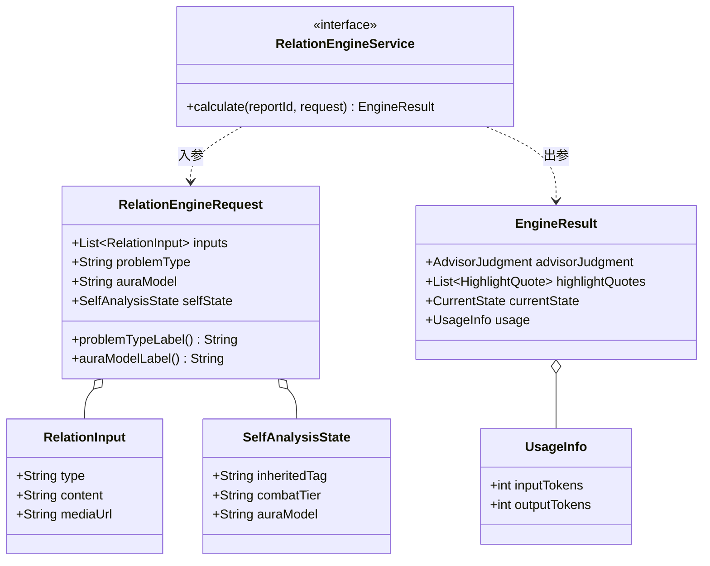

```java
package com.xiaodingtie.feeling.modules.relation.service;

import com.xiaodingtie.feeling.common.enums.AuraModel;
import com.xiaodingtie.feeling.modules.relation.enums.AppearanceLevel;
import com.xiaodingtie.feeling.modules.relation.enums.ProblemType;
import com.xiaodingtie.feeling.modules.relation.enums.TargetType;

import io.swagger.v3.oas.annotations.media.Schema;

import java.util.List;

/**
 * 关系解码器「免费洞察」引擎（军师鉴定 + 三段式洞察）。
 *
 * <p>真实实现调用豆包 doubao-seed-2.0-mini；Mock 实现返回固定示例，用于联调。
 */
public interface RelationEngineService {

    EngineResult calculate(Long reportId, RelationEngineRequest request) throws Exception;

    /** 单次输入：类型 + 文本 + 图片地址（多类型可并存） */
    @Schema(description = "单次材料输入")
    record RelationInput(
            @Schema(description = "输入类型：VOICE/TEXT/IMAGE", example = "TEXT") String type,
            @Schema(description = "文本内容（TEXT 类型时必填）", example = "我们最近总是吵架") String content,
            @Schema(description = "媒体地址（IMAGE 类型时为图片 URL，VOICE 时为音频 URL）") String mediaUrl
    ) {
    }

    record RelationEngineRequest(
            List<RelationInput> inputs,
            String problemType,
            String auraModel,
            String appearanceLevel,
            String targetType,
            SelfAnalysisState selfState
    ) {
        public String problemTypeLabel() {
            return safeLabel(c -> ProblemType.fromCode(c).getLabel(), problemType);
        }

        public String auraModelLabel() {
            return safeLabel(c -> AuraModel.fromCode(c).promptText(), auraModel);
        }

        public String appearanceLevelLabel() {
            return safeLabel(c -> AppearanceLevel.fromCode(c).getLabel(), appearanceLevel);
        }

        public String targetTypeLabel() {
            return safeLabel(c -> TargetType.fromCode(c).getLabel(), targetType);
        }

        private static String safeLabel(java.util.function.Function<String, String> toLabel, String code) {
            if (code == null || code.isBlank()) {
                return "";
            }
            try {
                return toLabel.apply(code);
            } catch (RuntimeException e) {
                return code;
            }
        }
    }

  
    @Deprecated
    @Schema(description = "旧版（历史数据兼容，新数据请用 highlightQuotes）")
    record CoreInsight(
            @Schema(description = "前缀铺垫文本", example = "前缀铺垫文本") String prefix,
            @Schema(description = "高亮重点", example = "高亮重点") String highlight,
            @Schema(description = "高亮后的过渡前缀文本", example = "，这背后反映出") String suffixPrefix,
            @Schema(description = "后缀收束文本", example = "。") String suffix
    ) {
    }


    @Schema(description = "标题预览")
    record ChapterTitle(
            @Schema(description = "章节序号（1~4）", example = "1") int no,
            @Schema(description = "章节标题", example = "章节标题") String title,
            @Schema(description = "章节摘要预览", example = "章节摘要预览") String summary
    ) {
    }


    @Schema(description = "定稿标题")
    record PaidChapter(
            @Schema(description = "章节序号（1~4）", example = "1") int no,
            @Schema(description = "章节标题", example = "章节标题") String title,
            @Schema(description = "章节摘要预览", example = "章节摘要预览") String summary
    ) {
    }


    List<PaidChapter> PAID_CHAPTERS = List.of(
            new PaidChapter(1, "解析", "解析"),
            new PaidChapter(2, "模板", "模板"),
            new PaidChapter(3, "训练", "训练"),
            new PaidChapter(4, "指南", "指南")
    );

  
    @Schema(description = "结果")
    record AdvisorJudgment(
            @Schema(description = "大标题", example = "") String title,
            @Schema(description = "副标题", example = "") String subtitle
    ) {
    }

    
    @Schema(description = "")
    record HighlightQuote(
            @Schema(description = "第一阶段文字（普通色）", example = "") String part1,
            @Schema(description = "第二阶段文字（高亮色）", example = "") String part2
    ) {
    }

    
    @Schema(description = "当前状态快照")
    record CurrentState(
            @Schema(description = "行为模式分类", example = "") String targetPattern,
            @Schema(description = "用户气场类型", example = "") String userPersona,
            @Schema(description = "核心矛盾总结", example = "") String coreConflict,
            @Schema(description = "当前阶段评估", example = "") String relationshipStage,
            @Schema(description = "一句话总结") String contextSummary
    ) {
    }

    record UsageInfo(int inputTokens, int outputTokens) {
    }


    @Schema(description = "整体状态快照")
    record SelfAnalysisState(
            @Schema(description = "专属标签") String inheritedTag,
            @Schema(description = "弱点关键词，≤15字") String visualWeaknessFocus,
            @Schema(description = "关键词，≤15字") String constellationShortboardFocus,
            @Schema(description = "用户段位") String combatTier,
            @Schema(description = "后续训练") String evolutionPath,
            @Schema(description = "气场画像 ") String auraModel
    ) {
    }


    record AiGenerationState(String modelName, String fullPrompt) {
    }


    @Schema(description = "免费核心结果")
    record EngineResult(
            @Schema(description = "标题 + 副标题") AdvisorJudgment advisorJudgment,
            @Schema(description = "列表") List<HighlightQuote> highlightQuotes,
            @Schema(description = "关键特征") List<String> keyFeatures,
            @Schema(description = "底部总结") String comfortSummary,
            @Schema(description = "当前状态快照") CurrentState currentState,
            UsageInfo usage,
            AiGenerationState aiGenerationState
    ) {
    }
}

```
---

# Java `record` 知识点笔记（以本项目 `RelationEngineService` 为教材）

## 一、一句话理解什么是 record

`record` 是 Java 14 预览、Java 16 正式定稿的**不可变数据载体（data carrier）**。它的定位就是取代那种"只有字段 + getter + 全参构造 + equals/hashCode/toString"的样板 POJO。

本项目 `RelationEngineService` 整文件几乎全是 `record`，原因很本质：它做的是"把高维结构化数据在层与层之间传递 / 把大模型 JSON 映射成强类型对象"，这正是 `record` 的主场。

```java
public interface RelationEngineService {
    EngineResult calculate(Long reportId, RelationEngineRequest request) throws Exception;
    // ...
    record RelationEngineRequest(
            List<RelationInput> inputs,
            String problemType,
            String auraModel,
            String appearanceLevel,
            String targetType,
            SelfAnalysisState selfState
    ) {
```

---

## 二、编译器为你自动生成了什么

写一个最朴素的 `record Point(int x, int y) {}`，编译器在字节码层面**自动**生成：

| 自动生成的内容 | 说明 |
| :--- | :--- |
| `private final int x, y` | 组件默认 `final` 不可变 |
| `int x()` / `int y()` | **访问器直接用字段名**，不是 `getX()` |
| `Point(int x, int y)` | 全参构造器（叫 canonical constructor） |
| `equals` / `hashCode` | 基于**所有组件** |
| `toString` | 形如 `Point[x=1, y=2]` |

⚠️ **最大易错点**：`record` 的访问器是 `inputs()` 而不是 `getInputs()`。这跟 Lombok 的 `@Data`、传统 JavaBean 约定都不一样。

---

## 三、聚焦你提到的第 30 行：它在"当前类"里怎么用

### 3.1 它是定义在 `interface` 里的嵌套 record

```java
    record RelationEngineRequest(
            List<RelationInput> inputs,
            String problemType,
            String auraModel,
            String appearanceLevel,
            String targetType,
            SelfAnalysisState selfState
    ) {
```

- 定义在 `interface` 内部 → 自动获得 `public static`。所以外部引用要写全名 `RelationEngineService.RelationEngineRequest`（第 131 行 `RelationReportService` 就是这样 `new` 出来的）。
- 它"嵌套引用"了另外两个嵌套 record：`RelationInput`（第 23 行）和 `SelfAnalysisState`（第 149 行）——`record` 可以嵌套 `record`，从而组合成**树状结构**。

### 3.2 它作为接口方法的入参（契约）

```19:19:src/main/java/com/xiaodingtie/feeling/modules/relation/service/RelationEngineService.java
    EngineResult calculate(Long reportId, RelationEngineRequest request) throwsException;
```

接口把"输入长什么样、输出长什么样"全部用嵌套 `record` 表达，相当于一个**能力的数据契约包**，调用方 import 一个接口就拿到全部类型，强内聚。

### 3.3 它身上的自定义实例方法，被实现类直接消费

`RelationEngineRequest` 不是干巴巴的数据，它还带了"派生字段"方法（把 code 翻译成中文语义）：

```java
        public String problemTypeLabel() {
            return safeLabel(c -> ProblemType.fromCode(c).getLabel(), problemType);
        }
        public String auraModelLabel() {
            return safeLabel(c -> AuraModel.fromCode(c).promptText(), auraModel);
        }
        public String appearanceLevelLabel() {
            return safeLabel(c -> AppearanceLevel.fromCode(c).getLabel(), appearanceLevel);
        }
        public String targetTypeLabel() {
            return safeLabel(c -> TargetType.fromCode(c).getLabel(), targetType);
        }
```

而在真正的引擎实现类 `RelationEngineServiceDoubao` 中，正是通过这些方法**拼装大模型提示词**：

```java
        if (!request.problemTypeLabel().isBlank()) {
            sb.append("【关系问题类型】").append(request.problemTypeLabel()).append("\n");
        }
        if (!request.auraModelLabel().isBlank()) {
            sb.append("【我的气场模型】").append(request.auraModelLabel()).append("\n");
```

> 这说明 `record` 的高级用法：**数据 + 基于该数据的轻量计算可以放在同一个不可变载体里**（很接近 DDD 的"值对象"思想），而不必另外写一堆 `XxxUtil`。

### 3.4 它还能写 private static 方法

```java
        private static String safeLabel(java.util.function.Function<String, String> toLabel, String code) {
            if (code == null || code.isBlank()) {
                return "";
            }
            try {
                return toLabel.apply(code);
            } catch (RuntimeException e) {
                return code;   // 脏数据不中断生成
            }
        }
```

`record` 内部可以定义静态字段、静态方法、实例方法、构造器、嵌套类型。

---

## 四、record 里"能写 / 不能写"的全清单

**能写的成员：**
- 组件（括号里的）→ 自动 `final` + 访问器 + 构造参数
- 静态字段 / 静态方法（如 `safeLabel`、下面的 `PAID_CHAPTERS` 常量）
- 实例方法（各种 `label()`）
- 构造器（全参 canonical / compact canonical / 额外自定义构造器）
- 嵌套 `record` / 嵌套 `class`

**不能写的：**
- ❌ `extends` 其他类（只能隐式 `extends Record`）
- ❌ 非 `static` 的实例字段（组件天生 `final`，不能再加可变字段）
- ❌ 把组件改成可变的

---

## 五、本项目里 record 的 7 种真实用法（都是经典场景）

### 1. 接口内嵌套 record = 数据契约包
`RelationEngineService` 把输入/输出/子结构全部定义为接口内嵌套 `record`，强内聚、易引用。

### 2. 泛型 record
```java
public record PageResponse<T>(
        List<T> items,
        long total,
        int page,
        int pageSize
) {
```
`record` 支持泛型，访问器/构造器都带 `<T>`。还配了静态工厂 `PageResponse.of(page)`。

### 3. 配置绑定 record（`@ConfigurationProperties`）
```java
@ConfigurationProperties(prefix = "security.jwt")
@Validated
public record JwtProperties(@NotBlank String secret, long accessTokenExpireMs,
                long refreshTokenExpireMs, int maxSessionsPerUser,
                MaxSessionsPerDevice maxSessionsPerDevice) {
    public record MaxSessionsPerDevice(int web, int app, int miniapp, int desktop) {}
}
```
整个配置类就是 `record`，配合 `@Validated` + `@NotBlank` 校验。Spring Boot 能直接把 yml 绑定到 `record`（因为它有全参构造器），内部还能嵌套 `record`。

### 4. 作为 JSON 反序列化目标（和 Jackson / 大模型配合）⭐
```java
    @JsonIgnoreProperties(ignoreUnknown = true)
    private record LlmSituation(
            Object controlPercent,
            String controlPercentSub,
            // ...
            List<CoreLlm> coreFromHim,
            List<CoreLlm> coreFromMe
    ) {}
    private record CoreLlm(String title, String desc) {}
```
`record` 的"组件名 = JSON 字段名"让 Jackson 直接映射，**不需要一堆 setter**。`@JsonIgnoreProperties(ignoreUnknown = true)` 让大模型多返回的字段被忽略——这非常适合对接 LLM 这种"输出结构不稳定"的场景。

### 5. 方法内私有 `record`（临时聚合 / 多返回值）
`TopicService.CoverUpload`、`ImageService.StoredUpload` 都是 `private record`，用于服务内部把"一次计算的多结果"打包返回，避免返回 `Map` 或 `List` 那种类型不安全的写法。

### 6. 不可变聚合 / 方法多返回值
`UsageInfo(int inputTokens, int outputTokens)` 在 `RelationEngineService`（第 139 行）、`RelationPaidEngineService`、`CombatEngineService`（扩展为 3 字段）多处出现，是"返回多个值"的干净替代方案。

### 7. LLM 结构化输出建模（AI 应用最经典的用法）⭐⭐
```java
    private record HomePageLlm(String mainTitle, String subTitle, List<SectionLlm> sections) {}
    private record SectionLlm(int no, String title, String summary, int readMinutes) {}
    private record Chapter1Llm(String summary, List<BreakdownLlm> threeBreakdowns, String closing) {}
    // ... 一整棵 record 树
```
把大模型的 JSON Schema 直接映射成一棵类型安全的 `record` 树，再用 `@JsonIgnoreProperties(ignoreUnknown=true)` 抗脏数据。这是现代 Java AI 应用里 `record` 最精髓的用武之地。

---

## 六、record vs class + Lombok 对比

| 维度 | `record` | `class` + `@Data` |
| :--- | :--- | :--- |
| 访问器命名 | `inputs()` | `getInputs()` |
| 不可变性 | 默认 `final` | 需 `@Value` |
| 能否继承类 | ❌ | ✅ |
| 可作 JPA 实体 | ❌（见下） | ✅ |
| 序列化/反序列化 | Jackson 原生支持 | 支持 |
| 样板代码量 | 极少 | 较少但有注解 |

---

## 七、坑 & 注意事项（重点记）

1. **访问器是 `inputs()` 不是 `getInputs()`**。JSON 字段映射 Jackson 默认按字段名没问题，但老框架或手写反射要小心。
2. **`record` 不能当 JPA `@Entity`**。JPA 需要可变性 / 懒加载代理，`record` 天生不可变，不合适。本项目所有 `record` 都用于 DTO / 值对象 / 配置 / JSON，实体仍是 `@Entity class`。
3. **想做构造时校验/归一化**用 compact constructor：
   ```java
   record Range(int lo, int hi) {
       Range {                       // 注意：没有参数列表，直接写 {}
           if (lo > hi) throw new IllegalArgumentException("lo>hi");
       }
   }
   ```
4. **一般不要重写 `equals`**：`record` 自动生成的 `equals` 已基于全部组件，重写反而容易出错。
5. 嵌套在 `interface` 中的 `record` 自动 `public static`。

---

## 八、"什么时候用 record"判定清单

- ✅ 只是传数据、无复杂行为 → `record`
- ✅ DTO / API 响应 / 配置 / JSON 映射 / 方法多返回值 → `record`
- ✅ **把大模型 JSON 结果建模成强类型树** → `record` 神器
- ❌ 需要可变性、继承、ORM 实体、丰富业务行为 → 用 `class`

---

## 附：第 30 行所在数据结构的关系图



---
